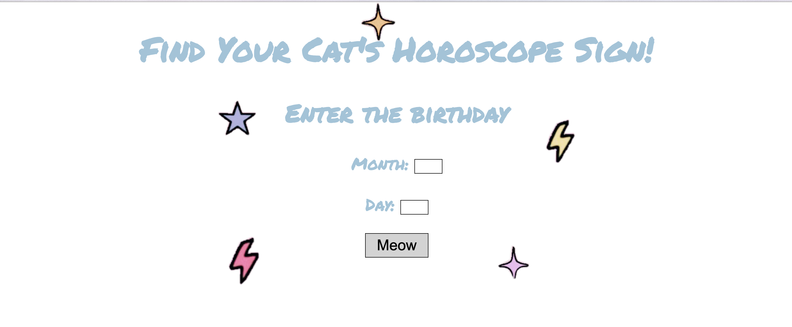

# Horoscope
A simple horoscope for cats that inputs the day and month.  

**View project in browser:** https://dfdev-horoscope.netlify.app

## Design and Development
**Skills Used** HTML, CSS, JavaScript:
I built this horoscope by breaking down its components and pseudo-coding what they would do (i.e, the twelve signs of the horoscope correlating with their dates). Doing so made it easier to translate into functions in JavaScript.

## Lessons Learned
In the beginning I started writing in JS by what I knew and after laying down the bulk of the foundation, I was able to optimize to achieve cleaner code. 
